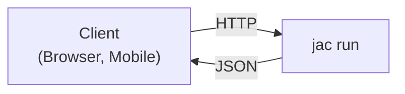

# Local API Server

> **Concept:** [Scale invariance](../../reference/plugins/jac-scale.md#the-scale-invariance-contract): your program text does not change with the shape of its deployment. `jac run` is the same program as `jac run`, served.

During development, `jac run` executes your program and exits. But production applications need to stay running and respond to HTTP requests from browsers, mobile apps, or other services. The `jac run` command transforms your Jac application into a persistent API server -- every walker and function marked with `:pub` or `:priv` access modifiers automatically becomes a REST endpoint, complete with authentication, JSON serialization, and API documentation.

This means you go from "Jac program that runs locally" to "HTTP API server that clients can call" with a single command change -- no Flask routes, no Express middleware, no API framework needed.

> **Prerequisites**
>
> - Completed: [Build an AI Day Planner](../first-app/build-ai-day-planner.md)
> - Time: ~15 minutes

---

## Overview

The `jac run` command turns your walkers and functions into REST API endpoints automatically:



---

## Quick Start

### 1. Create Your Walker

```jac
# main.jac
node Task {
    has title: str;
    has done: bool = False;
}

walker:pub get_tasks {
    can fetch with Root entry {
        tasks = [-->][?:Task];
        report [{"id": jid(t), "title": t.title, "done": t.done} for t in tasks];
    }
}

walker:pub add_task {
    has title: str;

    can create with Root entry {
        task = Task(title=self.title);
        root ++> task;
        report {"id": jid(task), "title": task.title, "done": task.done};
    }
}
```

> **Note:** The `:pub` modifier makes walkers publicly accessible without authentication. Without it, API endpoints require authentication tokens.

### 2. Start the Server

!!! note
    `main.jac` is the default entry point. If your entry point has a different name (e.g., `app.jac`), pass it explicitly: `jac run app.jac`.

```bash
jac run
```

Output:

```
  jac dev server v0.16.7

  ➜  Local:     http://localhost:8000/

  Server ready
```

### 3. Call the API

```bash
# Get all tasks (all walker endpoints use POST with /walker/ prefix)
curl -X POST http://localhost:8000/walker/get_tasks

# Add a task
curl -X POST http://localhost:8000/walker/add_task \
  -H "Content-Type: application/json" \
  -d '{"title": "Buy groceries"}'
```

---

## Server Configuration

### Port

```bash
# Custom port
jac run --port 3000
```

A port you pass is a contract. If it is already in use the server does not move to
another one, because whatever sits in front of it (a proxy, a port mapping, a health
check) is still addressing the port you asked for. It fails and names the port:

```
✖ Error: Port 3000 is already in use
```

The same applies to a port set in `jac.toml`, which `jac run` reads:

```toml
[serve]
port = 3000
```

Naming the port is what makes it a contract, not where you named it. A project that
pins 3000 usually has something addressing 3000, a proxy or an OAuth callback or a
hardcoded URL, and moving to 3001 would break it silently.

One exception, for now. On a microservice project -- one declaring
`[scale.microservices.routes]`, which `jac create --kind web-app` writes -- a
`[scale.microservices] gateway_port` in `jac.toml` does **not** pin, because the loaded
config supplies a default for that key and nothing downstream can tell a port you chose
from one that was merely assumed. Pass `--port` to pin the gateway.

Leave the port unset and the default behaves as before, relocating with a notice:

```
Port 8000 is in use, using port 8001 instead
```

`--api-port` follows the same rule when you pass it, and has no `jac.toml` key.

### Development Mode (HMR)

Hot Module Replacement for development:

```bash
jac run --dev
```

Changes to your `.jac` files will automatically reload.

### API-Only Mode

Skip client bundling and only serve the API:

```bash
jac run --dev --no-client
```

---

## API Endpoints

### Automatic Endpoint Generation

Each public walker becomes an endpoint:

| Walker | HTTP Method | Endpoint |
|--------|-------------|----------|
| `walker:pub get_users { }` | POST | `/walker/get_users` |
| `walker:pub create_user { }` | POST | `/walker/create_user` |
| `walker:pub delete_user { }` | POST | `/walker/delete_user` |

### Request Format

Walker parameters become request body:

```jac
walker:pub search_users {
    has query: str;
    has limit: int = 10;
    has page: int = 1;
}
```

```bash
curl -X POST http://localhost:8000/walker/search_users \
  -H "Content-Type: application/json" \
  -d '{"query": "john", "limit": 20, "page": 1}'
```

### Response Format

Walker `report` values become the response:

```jac
walker:pub get_user {
    has user_id: str;

    can fetch with Root entry {
        for user in [-->][?:User] {
            if user.id == self.user_id {
                report {
                    "id": user.id,
                    "name": user.name,
                    "email": user.email
                };
                return;
            }
        }
        report {"error": "User not found"};
    }
}
```

Response (all walker responses are wrapped in a standard envelope):

```json
{
  "ok": true,
  "type": "walker:pub:get_user",
  "data": {
    "result": null,
    "reports": [
      {
        "id": "123",
        "name": "Alice",
        "email": "alice@example.com"
      }
    ]
  },
  "error": null,
  "meta": {}
}
```

!!! note "Response Envelope"
    All walker API responses use this envelope format:

    - **`ok`**: `true` if the request succeeded, `false` on error
    - **`type`**: The walker type identifier
    - **`data.result`**: The walker's return value (if any)
    - **`data.reports`**: Array of all `report`ed values during traversal
    - **`error`**: Error message (if `ok` is `false`)
    - **`meta`**: Additional metadata

---

## Interactive Documentation

`jac run` automatically generates Swagger/OpenAPI docs:

- **Swagger UI:** `http://localhost:8000/docs`
- **ReDoc:** `http://localhost:8000/redoc`
- **OpenAPI JSON:** `http://localhost:8000/openapi.json`
- **Graph Visualizer:** `http://localhost:8000/graph` - interactive visualization of your application's graph

These endpoints are enabled by default. To disable them (e.g. in production), set `docs_enabled = false` in your `jac.toml`:

```toml
[scale.server]
docs_enabled = false
```

---

## Database Persistence

By default, Jac persists the graph in an embedded Postgres store: it boots lazily on first graph access, with one database per project, and requires no setup. Set `JAC_DB_URL` to point at an external Postgres instead.

### Custom Persistence

```jac
import json;

walker save_state {
    can save with Root entry {
        data = {
            "users": [u.__dict__ for u in [-->][?:User]],
            "posts": [p.__dict__ for p in [-->][?:Post]]
        };

        with open("state.json", "w") as f {
            json.dump(data, f);
        }

        report {"saved": True};
    }
}

walker load_state {
    can load with Root entry {
        try {
            with open("state.json", "r") as f {
                data = json.load(f);
            }

            for u in data["users"] {
                root ++> User(**u);
            }

            report {"loaded": True};
        } except FileNotFoundError {
            report {"loaded": False, "reason": "No saved state"};
        }
    }
}
```

---

## Environment Variables

### Accessing Environment in Code

```jac
import os;

walker get_config {
    can fetch with Root entry {
        report {
            "database_url": os.getenv("DATABASE_URL", "postgresql://jac@localhost:5432/jac"),
            "api_key": os.getenv("API_KEY"),
            "debug": os.getenv("DEBUG", "false") == "true"
        };
    }
}
```

---

## Middleware and Hooks

### Request Logging

```jac
walker _before_request {
    has request: dict;

    can log with Root entry {
        print(f"Request: {self.request['method']} {self.request['path']}");
    }
}
```

### Authentication Middleware

```jac
walker _authenticate {
    has headers: dict;

    can check with Root entry {
        token = self.headers.get("Authorization", "");

        if not token.startswith("Bearer ") {
            report {"error": "Unauthorized", "status": 401};
            return;
        }

        # Validate token...
        report {"authenticated": True};
    }
}
```

---

## Health Checks

### Liveness Probe

```jac
walker:pub health {
    can check with Root entry {
        report {"status": "healthy"};
    }
}
```

```bash
# Built-in health endpoint (provided by the scale subsystem)
curl http://localhost:8000/healthz

# Custom health walker endpoint (POST to /walker/<name>)
curl -X POST http://localhost:8000/walker/health
# {"status": "healthy"}
```

### Readiness Probe

```jac
walker:pub ready {
    can check with Root entry {
        # Check dependencies
        db_ok = check_database();
        cache_ok = check_cache();

        if db_ok and cache_ok {
            report {"status": "ready"};
        } else {
            report {"status": "not_ready", "db": db_ok, "cache": cache_ok};
        }
    }
}
```

---

## CLI Options Reference

| Option | Description | Default |
|--------|-------------|---------|
| `--port`, `-p` | Server port | 8000 |
| `--dev`, `-d` | Enable Hot Module Replacement | false |
| `--no-client`, `-n` | Skip client bundling (API only) | false |
| `--faux`, `-f` | Print API docs only (no server) | false |

---

## Example: Full API

```jac
# api.jac
import from datetime { datetime }

node User {
    has name: str;
    has email: str;
    has created_at: str;
}

# List all users
walker:pub list_users {
    can fetch with Root entry {
        users = [-->][?:User];
        report [{
            "id": jid(u),
            "name": u.name,
            "email": u.email
        } for u in users];
    }
}

# Get single user
walker:pub get_user {
    has user_id: str;

    can fetch with Root entry {
        for u in [-->][?:User] {
            if jid(u) == self.user_id {
                report {
                    "id": jid(u),
                    "name": u.name,
                    "email": u.email,
                    "created_at": u.created_at
                };
                return;
            }
        }
        report {"error": "Not found"};
    }
}

# Create user
walker:pub create_user {
    has name: str;
    has email: str;

    can create with Root entry {
        user = User(
            name=self.name,
            email=self.email,
            created_at=datetime.now().isoformat()
        );
        root ++> user;
        report {"id": jid(user), "name": user.name, "email": user.email};
    }
}

# Update user
walker:pub update_user {
    has user_id: str;
    has name: str = "";
    has email: str = "";

    can update with Root entry {
        for u in [-->][?:User] {
            if jid(u) == self.user_id {
                if self.name { u.name = self.name; }
                if self.email { u.email = self.email; }
                report {"id": jid(u), "name": u.name, "email": u.email};
                return;
            }
        }
        report {"error": "Not found"};
    }
}

# Delete user
walker:pub delete_user {
    has user_id: str;

    can remove with Root entry {
        for u in [-->][?:User] {
            if jid(u) == self.user_id {
                del u;
                report {"deleted": True};
                return;
            }
        }
        report {"error": "Not found"};
    }
}

# Health check
walker:pub health {
    can check with Root entry {
        report {"status": "ok", "timestamp": datetime.now().isoformat()};
    }
}
```

Run it:

```bash
jac run --port 8000 --dev api.jac
```

Test it:

```bash
# Create user
curl -X POST http://localhost:8000/walker/create_user \
  -H "Content-Type: application/json" \
  -d '{"name": "Alice", "email": "alice@example.com"}'

# List users
curl -X POST http://localhost:8000/walker/list_users

# Health check
curl -X POST http://localhost:8000/walker/health
```

---

## Next Steps

- [Kubernetes Deployment](kubernetes.md) - Scale with the built-in scale subsystem
- [Authentication](../fullstack/auth.md) - Add user login
